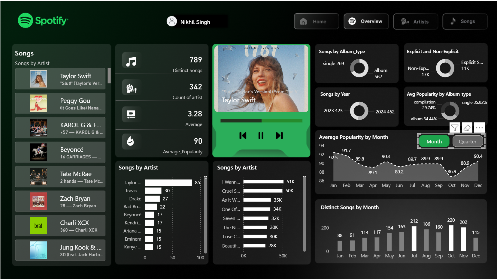
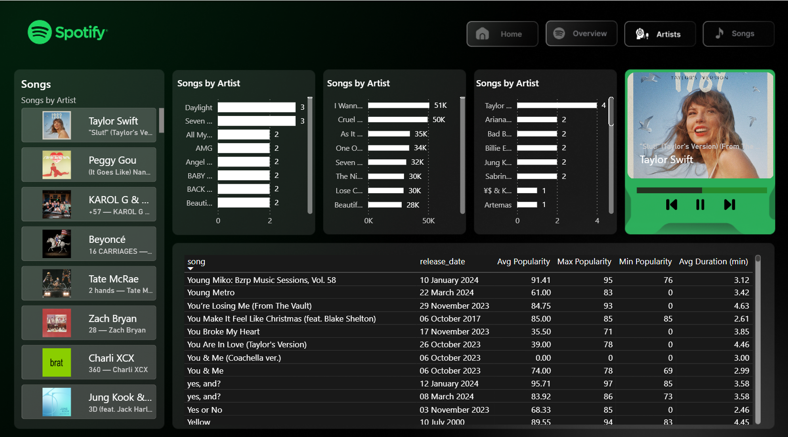
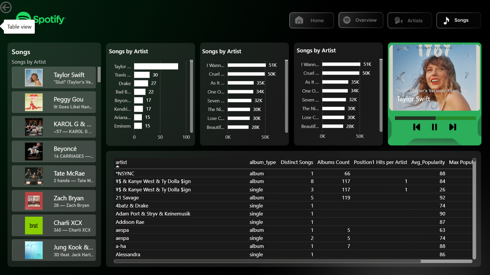

# Spotify Data Analytics Dashboard

This project analyzes Spotify streaming data using Power BI to identify trends in artists, songs, and popularity.  
The dashboard provides interactive insights into music performance using dynamic charts, KPIs, and filters.

---

## Tools Used
- Power BI
- Power Query
- DAX

---

## Project Objective
The objective of this project is to analyze Spotify music data and build an interactive dashboard that helps users understand trends in music popularity, artist performance, and song releases.

---

## Key Insights
- Identified top artists based on popularity and number of songs.
- Analyzed the most streamed tracks and their popularity.
- Observed music trends across different years.
- Compared album types such as singles, albums, and compilations.

---

## Features
- Interactive filters for artist, genre, and year.
- Dynamic charts and KPIs for quick insights.
- Data cleaning and transformation using Power Query.
- DAX measures for calculating metrics such as average popularity and distinct songs.

---

## Dashboard Preview

### Home Page

### Overview Page

### Artists Analysis

### Songs Dataset

---

## Conclusion
This dashboard helps users quickly explore Spotify music data and understand patterns in artist popularity, song trends, and album performance through interactive visualizations.
